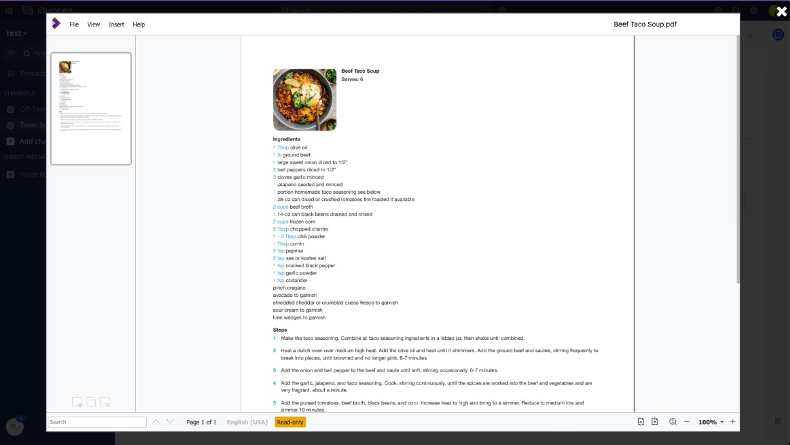

# Using this demo

1. Clone the repo <https://github.com/coltoneshaw/mattermost-collabra-demo>

    ```bash
    git clone https://github.com/coltoneshaw/mattermost-collabra-demo
    ```

2. Access the repo

    ```bash
    cd mattermost-collabra-demo
    ```

3. Run docker compose up inside the directory where your compose file is. You’ll see logs streamed to the terminal.

    ```bash
    docker compose up
    ```

4. [Download the latest Collabra plugin, which should be v1.1.0](https://github.com/CollaboraOnline/collabora-mattermost/releases/tag/1.1.0)

5. Upload the Collabra plugin to Mattermost.

6. Find your computer's local IP address

    - On Mac for Wifi, do `Ipconfig getifaddr en1`
    - On Mac for Ethernet, do `Ipconfig getifaddr en0`

7. Access Mattermost via your local IP from above, so for example, `192.168.1.2:8065`

8. Modify your site URL to be the `localIP:8065``

    

9. Restart Mattermost. This means canceling the docker-compose run with `control + c`` in the terminal it’s running in.

10. Start Mattermost again with `docker compose up``

11. Go to your `localIP:8065`` in browser

12. **System Console > Plugins > Collabra Online** and **enable** the plugin, setting the address to your `localIP:9980`

      

13. Go to your team and make a post with a supported file, like csv, pdf, docx.

14. Click the view button on the post

    

15. Congrats, you now have collabra.

    

**Notes: It is editing the actual file on the file system for Mattermost. So, any changes will impact the stored file.**
